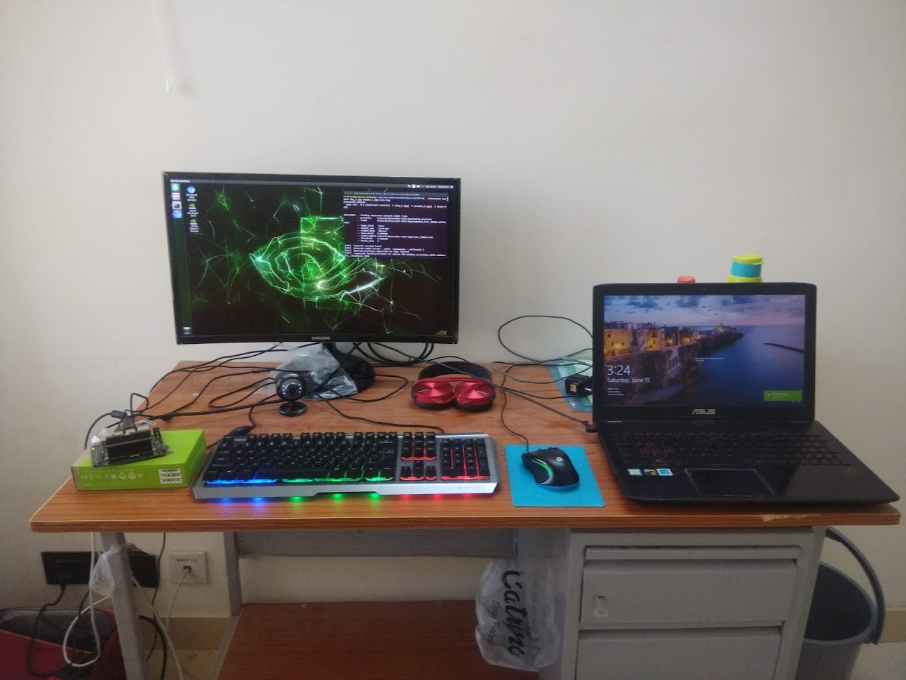
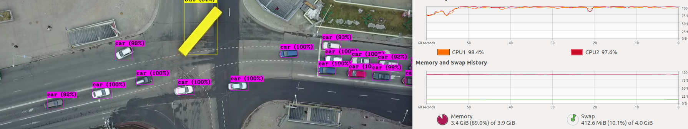
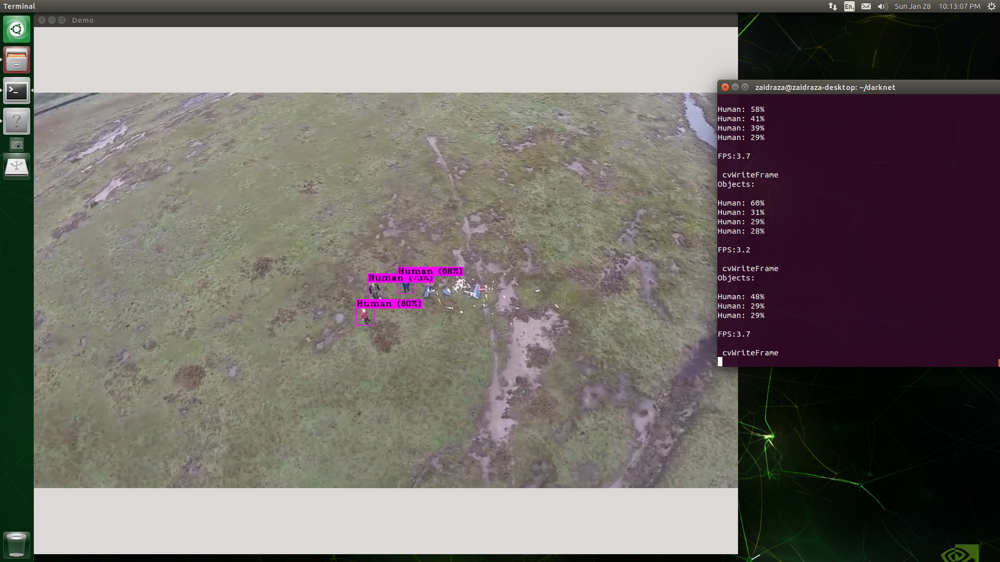
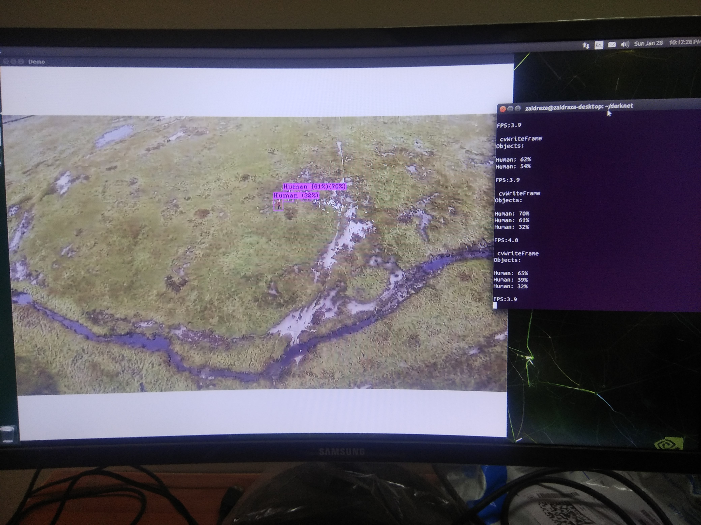
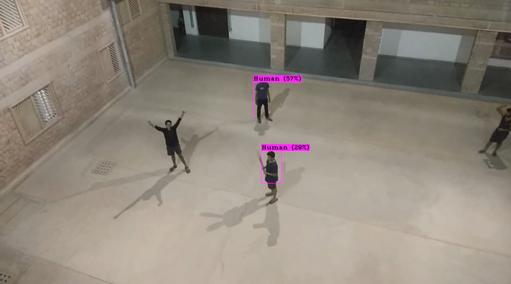
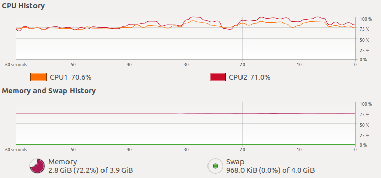
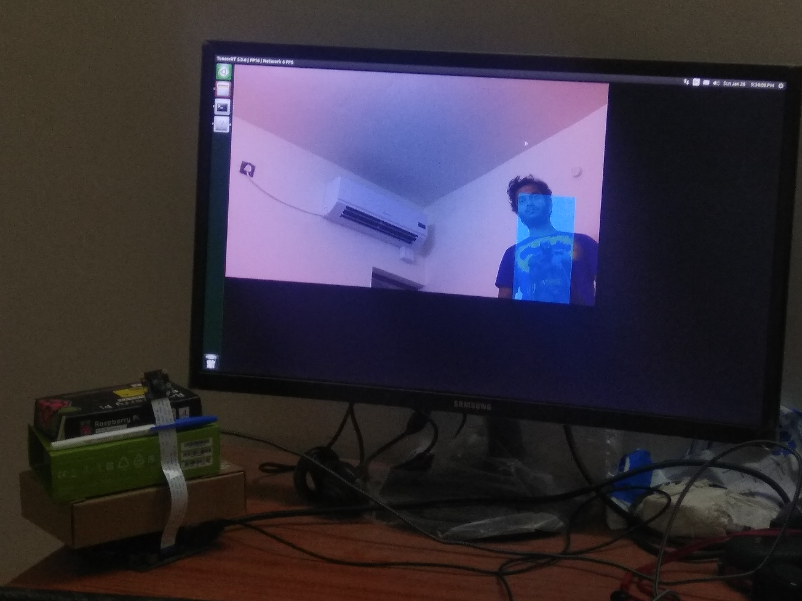

# UGRI Project (IIT Jodhpur)
Realtime Lightweight Object Detection On Nvidia Jetson Nano to be deployed on drone efficiently (Work done at IIT Jodhpur)

NOTE: This work was done before Nvidia Jetson Nano was officially released in India.

I used this forked version of SSD (Single Shot Detector) :
(It was based on Caffe)
https://github.com/weiliu89/caffe/tree/ssd

To test SSD, 
I used a script that I have included by the name "ssd_mobilenet", that I have placed inside SSD Scripts Folder.
To detect custom classes, simply change the no. and name of classes in classNames.
If the frame window lags a lot, increase the wait key of imshow window.

The command and parameters are:
python3 mobilenet_ssd_python.py --[params] 
The parameters are :
–video: Path file video.
–prototxt: Network file is .prototxt
–weights: Network weights file is .caffemodel
–thr: Confidence threshold.

I used this forked version of darknet's YOLO :
https://github.com/AlexeyAB/darknet

## Screenshots for various usage tests:
### Setup for Jetson Nano

### Resources Test 1 of Jetson Nano

### Testing Jetson Nano for Search and Rescue Ops

### Test in Hostel

### Usage Resources Test 2 of Jetson Nano

### Final Test of Jetson Nano with Raspberry Pi Cam v2

### To train a model,
Use the command :
./darknet detector train cfg/voc.data cfg/yolov3-voc.cfg 
Where, after "train"
First parameter is the name of the data file.
Second parameter is the name of the Confguration file of the Yolo model.
Third parameter is the pretrained weights. 
But, if you want to train from scratch, do not write anything.

### When to stop training?
1. You should stop when average loss no longer decreases by a huge amount.
2. You should choose the weights with the highest mAP value. 
To know mAP values subsequently, you can include in the command as :
./darknet detector train data/obj.data yolo-obj.cfg darknet53.conv.74 -map
while training.

### To test YOLO :
On image :
./darknet detector test cfg/coco.data cfg/yolov3.cfg yolov3.weights image-name
On video :
./darknet detector demo cfg/coco.data cfg/yolov3.cfg yolov3.weights video-name
On video, and save the output video :
./darknet detector demo cfg/coco.data cfg/yolov3.cfg yolov3.weights video-name -ext_output output-video-name.mp4

### To test the Raspberry Pi Camera Module V2 :
nvgstcamera-1.0

### To test YOLO model on the live video from cam :
Use the following pipeline :
"nvarguscamerasrc ! video/x-raw(memory:NVMM),width=1280, height=720, framerate=30/1, format=NV12 ! nvvidconv ! video/x-raw, format=BGRx, width=640, height=360 ! videoconvert ! video/x-raw, format=BGR ! appsink"

as :
./darknet detector demo cfg/coco.data cfg/yolov3.cfg yolov3.weights "nvarguscamerasrc ! video/x-raw(memory:NVMM),width=1280, height=720, framerate=30/1, format=NV12 ! nvvidconv ! video/x-raw, format=BGRx, width=640, height=360 ! videoconvert ! video/x-raw, format=BGR ! appsink"

